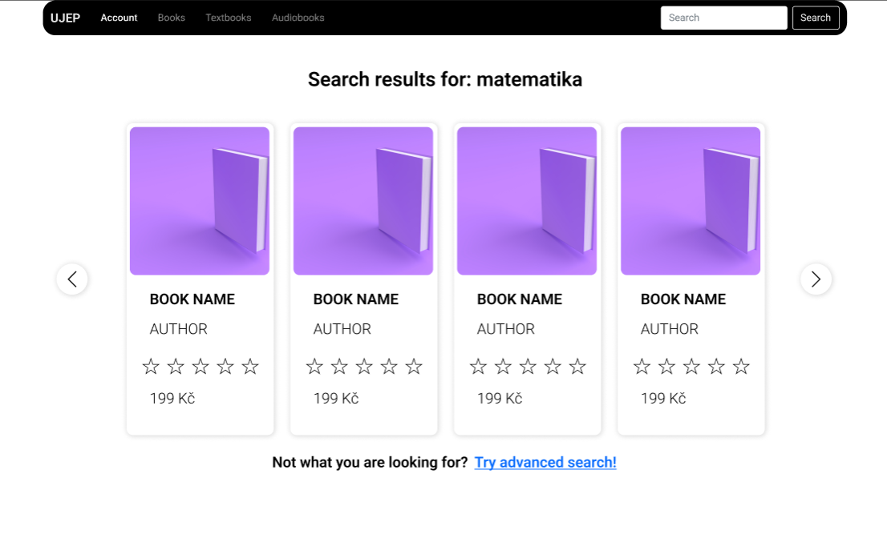

# NoSQL college class project

Book e-shop web-app

## Main purpose

Creating functional lightweight web-app to learn front-end/**mainly** back-end, while keeping in mind CAP theorem. My goal was also to create web-app that I can re-use for another class, where Im working with MySQL.

### Tech used:
1) DigitalOcean linux droplet
2) Flask (Python)
3) HTML, Bootstrap, Jinja
4) MongoDB + Redis for caching
5) Docker for running both MySQL and NoSQL version of website on the same droplet
6) Noe4J
7) Figma for UI design

